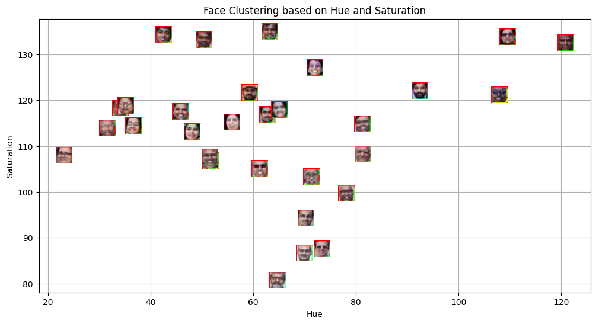
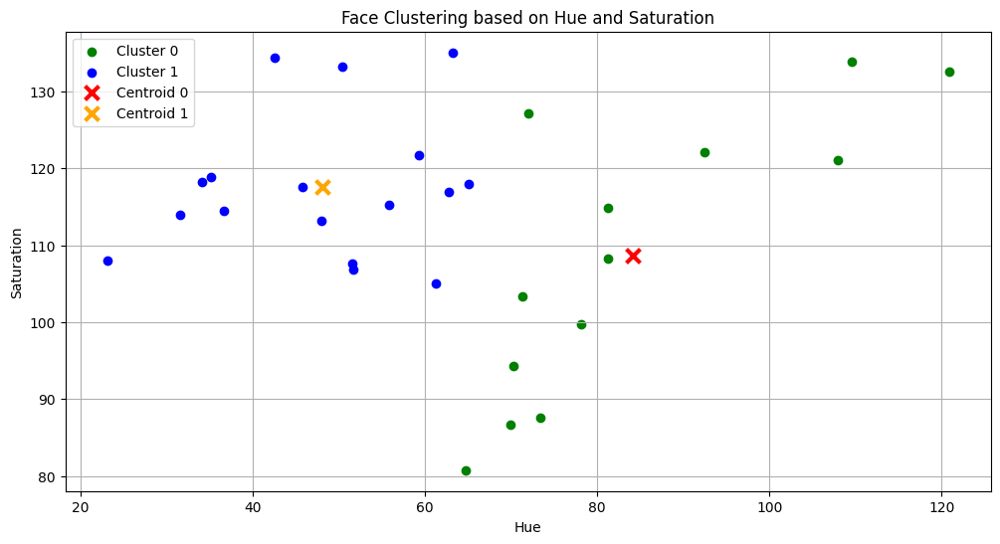
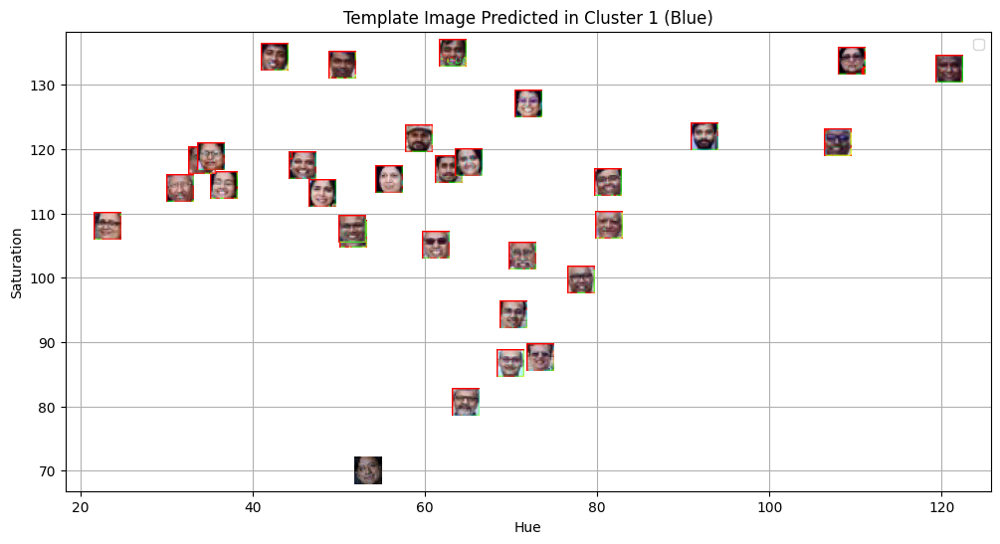
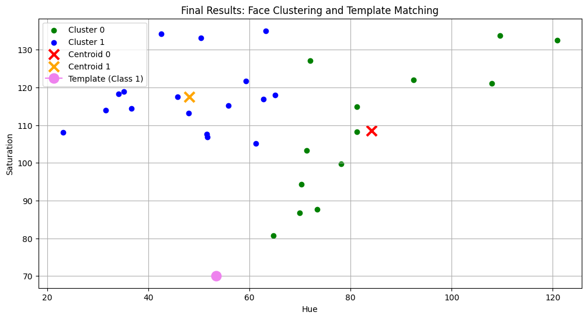

# MLPR Lab 5: Face Detection and Clustering

This repository contains the work for Labs of the Machine Learning and Pattern Recognition (MLPR) course. The primary focus of this lab(Lab-5) is face detection and unsupervised clustering using color features.

## Aim
The objective of this lab is to:
1.  Detect faces in a group image using Haar-cascade classifiers.
2.  Extract Hue and Saturation features from the detected face regions.
3.  Apply k-Means clustering to group faces based on their color characteristics.
4.  Verify the clustering model using a template image.

## Methodology

### 1. Face Detection
We used the OpenCV Haar-cascade classifier (`haarcascade_frontalface_default.xml`) to identify face regions in the `Plaksha_Faculty.jpg` image.

### 2. Feature Extraction
For each detected face, we:
- Converted the image region from BGR to the **HSV (Hue, Saturation, Value)** color space.
- Calculated the **mean Hue** and **mean Saturation** values as the representative features for each face.

### 3. k-Means Clustering
We applied the **k-Means algorithm** (with $k=2$) to the extracted features. This process allows us to group faces that have similar skin tones or lighting conditions as captured by the Hue and Saturation dimensions.

### 4. Template Matching
A separate image (`Dr_Shashi_Tharoor.jpg`) was used as a template. We detected the face, extracted its Hue and Saturation, and used the trained k-Means model to predict which cluster it belongs to.

## Key Findings

### 1. Initial Face Detection
Using Haar-cascade classifiers, we successfully identified face regions in the group image.

### 2. Feature Visualization (Hue vs. Saturation)
The plot below shows each detected face mapped onto the Hue-Saturation space. Individual face thumbnails are used as markers to visually correlate color profiles with their position in the feature space.

### 3. k-Means Clustering Results
The algorithm was tasked with grouping the faces into two distinct clusters.

**Cluster Distribution:**
The points are colored by their cluster assignment (Green vs. Blue), with red and orange markers indicating the centroids.

### 4. Template Image Analysis
A template image of Dr. Shashi Tharoor was processed using the same pipeline.

**Template Detection:**

**Final Result & Classification:**
The template face's Hue and Saturation were plotted (Violet circle) relative to the existing clusters to determine its class assignment.

## Conclusions
- **Color Feature Effectiveness:** Hue and Saturation are effective low-level features for initial image clustering tasks where color distribution is a primary differentiator.
- **Unsupervised Learning:** k-Means successfully identified inherent groupings in the face data without pre-labeled categories.
- **Robustness:** The model successfully classified the template image into one of the pre-defined color clusters based on its mean HSV values.
- **Applications:** This methodology can be extended to automated photo organization, skin tone analysis, and lighting normalization in computer vision pipelines.

---
*Developed as part of the MLPR Course, Spring 2026.*
